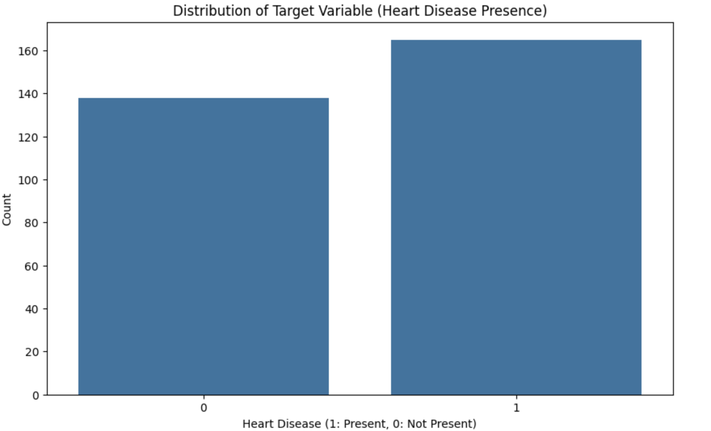
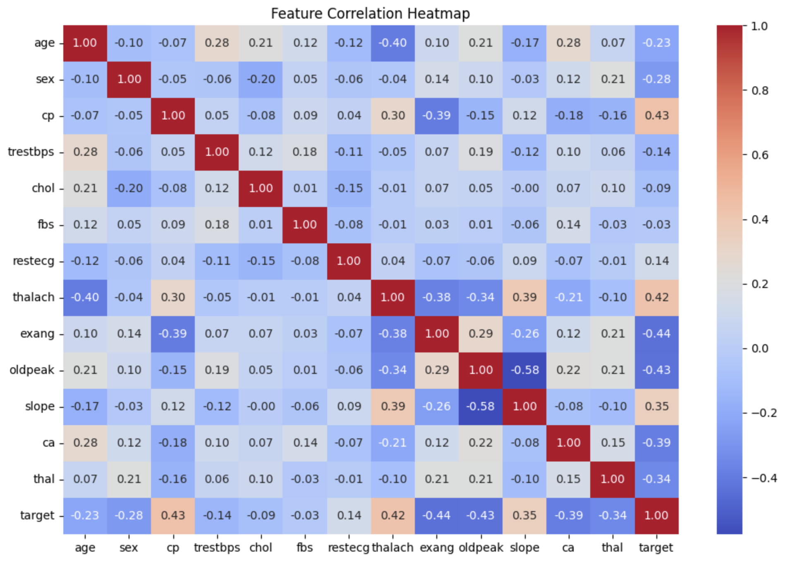
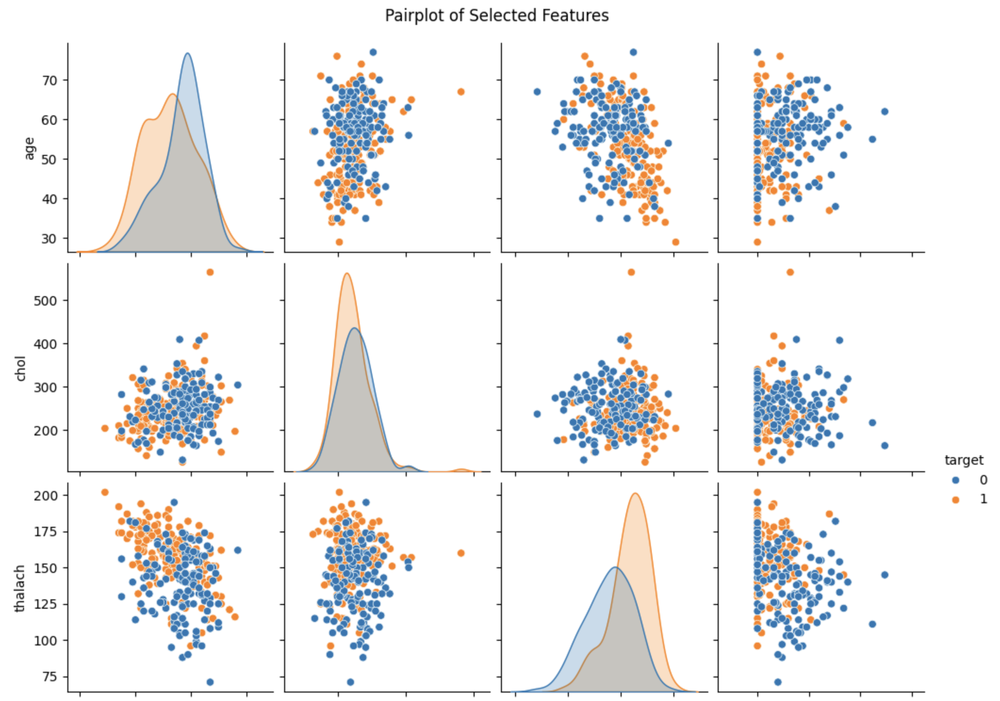
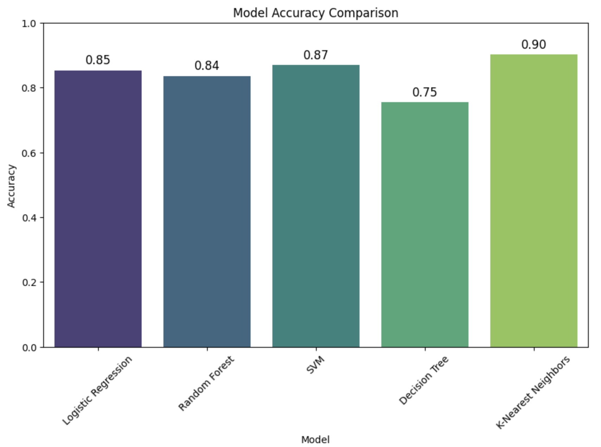

# 🫀 Heart Disease Prediction using Machine Learning


## 📌 Project Overview
Heart disease is a major cause of mortality worldwide. Early prediction enables timely treatment and prevention.  
This project uses **Machine Learning algorithms** to predict the presence of heart disease from health metrics like age, cholesterol level, and maximum heart rate.

---

## 🎯 Objectives
- Analyze and visualize the dataset.
- Build predictive ML models.
- Compare accuracy across different algorithms.
- Identify the most effective prediction model.

---

## 📂 Dataset
- **Source:** CSV file containing **303 rows** and **14 columns**.
- **Features:** Age, cholesterol level, maximum heart rate, resting blood pressure, etc.
- **Target Variable:**  
  - `1` → Heart disease present  
  - `0` → No heart disease  
- **Missing Values:** None.
- **Data Types:** Numerical.

---

## 📊 Exploratory Data Analysis (EDA)

### Target Variable Distribution


### Feature Correlation Heatmap


### Age Distribution by Target Variable


> **Note:** Plots are saved in the `plots/` folder.

---

## 🛠 Data Preprocessing
- **Feature Selection:** Separated features and target.
- **Train-Test Split:** 80% training, 20% testing.
- **Scaling:** Used `StandardScaler` for normalization.

---

## 🤖 Machine Learning Models
1. Logistic Regression
2. Random Forest Classifier
3. Support Vector Machine (SVM)
4. Decision Tree
5. K-Nearest Neighbors (KNN)

---

## 📈 Model Results

| Model                    | Accuracy |
|--------------------------|----------|
| Logistic Regression      | 85%      |
| Random Forest            | 84%      |
| Support Vector Machine   | 87%      |
| Decision Tree            | 75%      |
| **KNN**                  | **90%**  |

### Accuracy Comparison


---

## 📌 Conclusion
- **Best Model:** KNN with 90% accuracy.
- KNN may be the most effective for this dataset, but further tuning could improve results.
- Potential improvements:
  - Hyperparameter tuning.
  - Additional datasets/features.
  - Cross-validation for better generalization.

---

## 🚀 How to Run

1. **Clone Repository**
   ```bash
   git clone https://github.com/yourusername/heart-disease-prediction.git
   cd heart-disease-prediction
